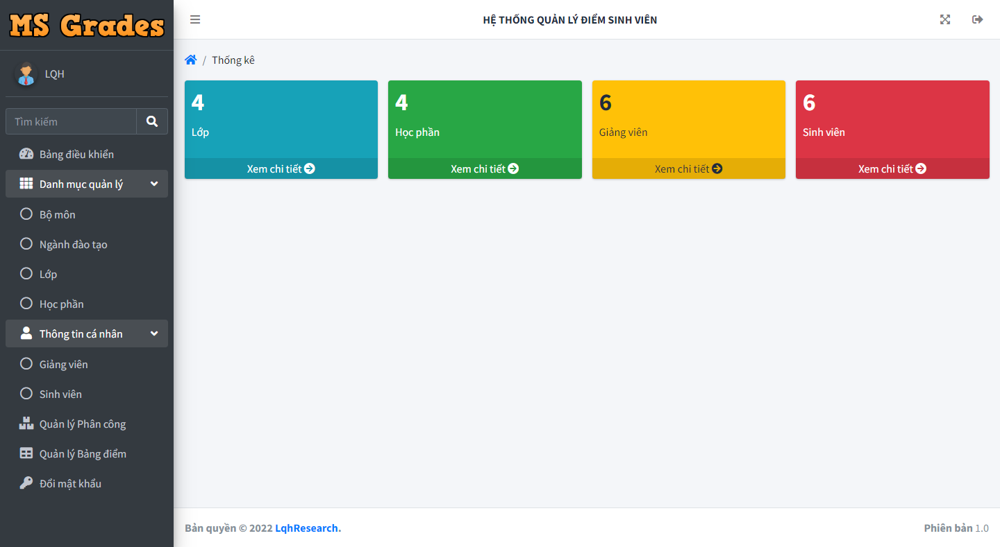
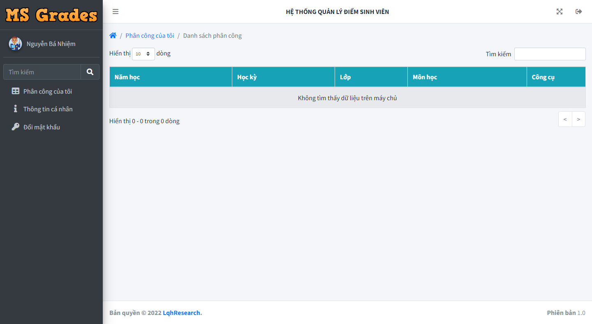
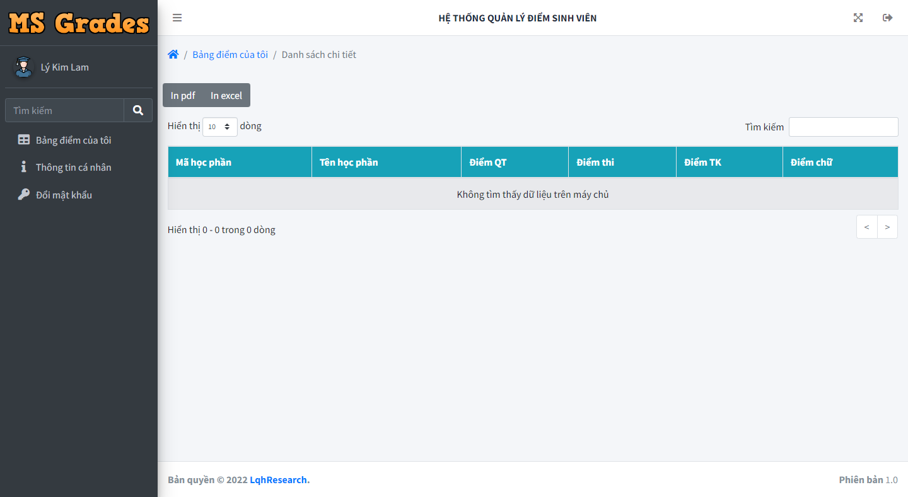

# Phần mềm quản lý điểm sinh viên khoa Kỹ thuật - Công nghệ

## :pushpin: Ngôn ngữ & Công cụ lập trình
 - [x] JSP
 - [x] MySQL
 - [x] Netbean 8.2
 - [x] Xampp 8.0.16

## :framed_picture: Hình ảnh
- Đăng nhập

- Quản trị viên

- Giảng viên

- Sinh viên
